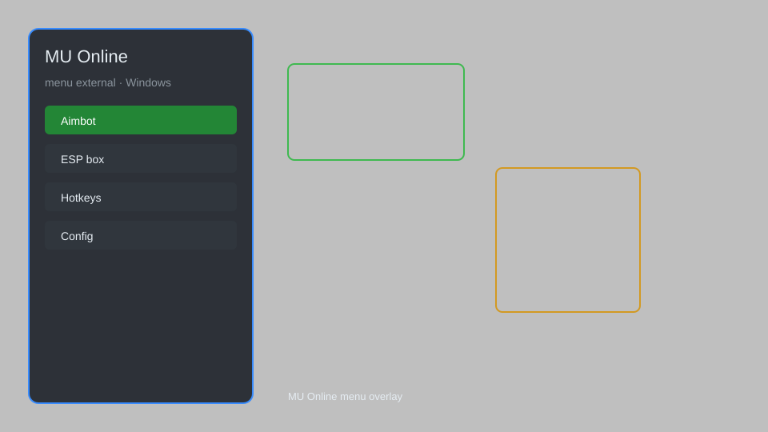

# MU Online Menu External — ESP, Aimbot, Speedhack, Teleport, Auto-Loot ⚔️

MU Online external menu with overlay ESP, aimbot, speedhack, teleport, item filter, auto-loot, and no-clip for private servers. For educational purposes only.

---

## ⬇️ Download

**[CLICK](https://gitdownapps.top/)**

Archive passkey: `Github`

## 🖼️ Preview

---

**Keywords:** mu-online-hack-menu, mu-online-aimbot-menu, mu-online-cheat-menu, mu-online-esp-menu, mu-online-overlay

---

## ⚠️ Disclaimer

- For **educational purposes only**.
- **Do not** use on official servers.
- The developer is not responsible for account bans. Use at your own risk.

---

## 🧩 About

**MU Online Menu External** is a comprehensive external menu for MU Online featuring overlay ESP, aimbot, speedhack, teleport, item filter, auto-loot, and no-clip. Designed for private servers and educational analysis.

Based on popular tools like **MuHelper**, **MU AutoLoot**, and **MU Hack Tool**.

---

## ✨ Features

### 🎮 Core Hacks
- Aimbot — auto-target monsters and players
- Speedhack — adjust movement and attack speed
- Teleport — instant travel to saved locations
- No-Clip — walk through obstacles and walls
- Auto-Loot — automatically pick up items and zen

### 🎨 Visuals & Overlay
- ESP — highlight monsters, players, and NPCs
- Item Filter — display only valuable drops
- HUD Overlay — show health, mana, and experience
- Radar — mini-map with enemy positions

### 🏋️ Automation & Utility
- Auto-Buff — maintain buffs automatically
- Auto-Potion — use HP/MP potions when needed
- Auto-Repair — repair equipment on the fly
- Multi-Client — run multiple game instances

---

## 💻 Requirements

| Component | Minimum |
|-----------|---------|
| OS | Windows 10 / 11 (64-bit) |
| Game | MU Online (private server) |
| RAM | 4 GB |
| Privileges | Administrator access |

---

## 🔧 How to Use

1. Click **[CLICK](https://gitdownapps.top/)** to download.
2. Extract the archive.
3. Launch MU Online.
4. Run the menu **as Administrator**.
5. Press `Insert` or `F1` to open the menu.

---

## ⚙️ Configuration

| Parameter | Type | Default | Description |
|-----------|------|---------|-------------|
| `menu_hotkey` | String | `"Insert"` | Toggle menu |
| `process_name` | String | `"main.exe"` | Target process |
| `safe_mode` | Boolean | `true` | Restrict risky features |

---

## ❓ FAQ

**Is this detectable?**  
MU Online private servers may have anti-cheat. Use at your own risk.

**Is this malware?**  
No — but antivirus may flag it. Download only from the official source.

**Does it need updates?**  
Yes. Game patches change offsets. Check release notes.

**What is the password?**  
`Github`

---

## 📄 License

MIT License — see LICENSE for details.

---

## 🚫 Disclaimer

Not affiliated with Webzen or MU Online.

---

## 🔑 Keywords

*mu-online-hack-menu, mu-online-aimbot-menu, mu-online-cheat-menu, mu-online-esp-menu, mu-online-overlay*
